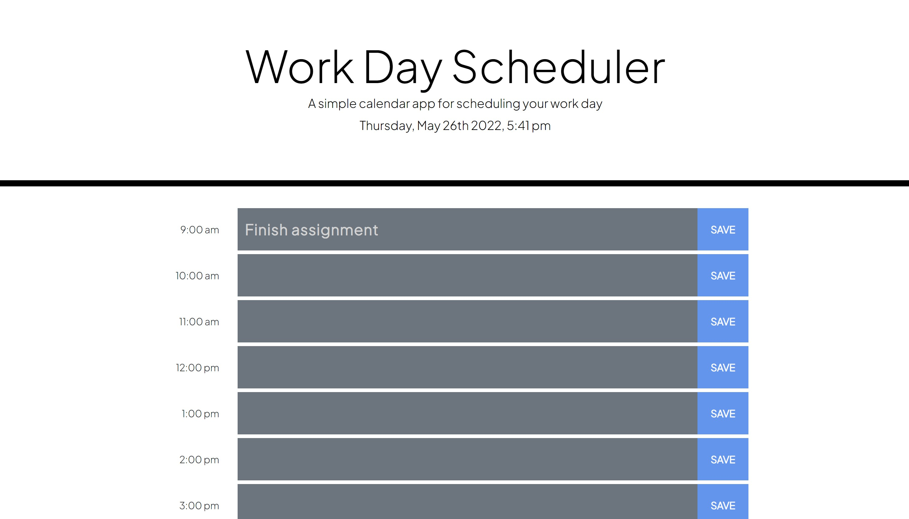

# Work Day Scheduler

## Objective
The goal here was to create a UI where a user could log their hourly tasks each day. Upon inputting their tasks they could save them and with a browser refresh their tasks would remain. In addition to this, the colours of the input blocks would change depending on the time of day. This would allow the user to visually see what they should have completed, should be working on, and will need to work on as the day progresses.

## Approach
My approach was to keep the UI simple and easy to navigate through. I used bootstrap elements in the HTML and minor additional styling in CSS. Once the template was created I used jQuery to ensure the objectives were met. This included adding the current date and time at the top of the page by using Momentjs.

## Reflection
After completion, I brainstormed additional ways to tackle this. It made sense to append items into the HTML using JavaScript which is an approach I did not think of at first. Going forward I have decided I will take even more time in my thought process with new projects before beginning any coding. The scheduler works and I am quite happy with the turnout otherwise.

## Final Product
[Click here to view](https://jessicamdittrich.github.io/CHG-JD052722)